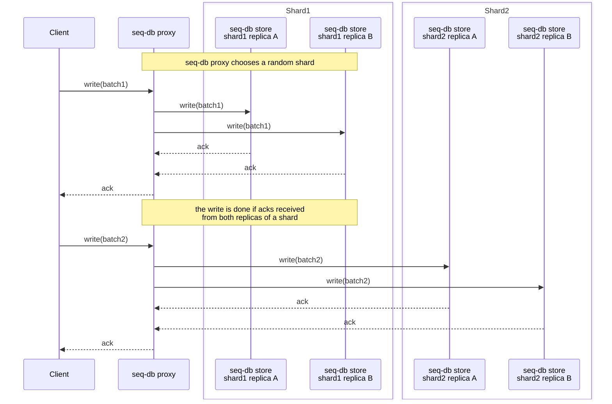
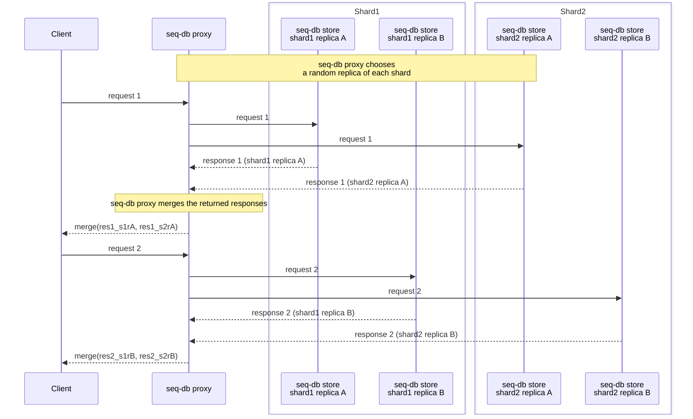

# Cluster-Mode Architecture

## Components overview

In cluster mode, seq-db consists of two main components: 
 - seq-db store (seq-db instance running with `--mode=store flag`)
 - seq-db proxy (seq-db instance running with `--mode=proxy flag`).

### seq-db store
seq-db store is the stateful storage component, that keeps all the
written documents and handles both reads and writes.
All data written into seq-db eventually makes its way to one or multiple stores.


#### Key characteristics
- Deployed as k8s `Statefulset`
- Share-nothing architecture: a seq-db store instance is unaware of any other stores.
- Maintains in-memory and on-disk inverted indexes, allowing search on indexed fields. 


#### File layout
seq-db store keeps all document data in three file types:

| File type | Purpose                                        |
|-----------|------------------------------------------------|
| `.docs`   | Stores compressed batches of raw log documents |
| `.meta`   | Tokenized metadata stream (used for recovery)  |
| `.index`  | On-disk inverted index                         | 


Because the dataset is stored in these three file types, moving or restoring a
shard is straightforward: simply `cp` / `rsync` the directory
to the target node and start the pod.

Read more about file types and their internal structure [here](internal/fractions.md).

#### Durability
A write operation is acknowledged only after the payload is safely persisted:

```
write, fsync   # .meta file
write, fsync   # .data file
```
That is, two write system calls followed by two fsync
calls—guaranteeing the data survives a node 
crash or restart before the client receives a success response. 
Indexing occurs asynchronously, so it usually takes under 1 
second before the newly written documents are available for search queries. 
Note that this value may be slightly higher when bulk load spikes happen

### seq-db proxy
seq-db proxy is a stateless coordinator for all read & write traffic. 
It maintans a user-defined cluster topology, and allows changes in read-write 
traffic distribution without changes to the stateful components


#### Key characteristics
- Deployed as k8s `Deployment`
- Performs logical replication between stores
- Routes traffic between storage tiers (hot/cold stores)

seq-db proxy tokenizes every incoming document
and compresses batches with zstd / lz4 
before sending batches to seq-db stores.

### Read-path & write-path (rf=2)
Let's take a look at an example architecture with 4 seq-db shards and replication-factor=2 
(each log must be stored in two separate seq-db stores). 
Note that replicas of shard can be located in different availability zones.

### Write-path
The write commits only after seq-db proxy receives an ack **from all replicas of the addressed shard**.



### Read-path
While the written document must be acknowledged by all replicas
of a shard, 
a read is successful when **at least one replica of each shard** returns a response.



## Notes about replication & consistency
seq-db doesn't have any mechanism to keep replicas consistent between each other. 
That is, if a write operation succeeds on a replica of a shard and fails on another replica, the replicas 
would be out of sync and won't be (automatically) synced. 
The only given guarantee is that a write operation will succeed only having at least RF replicas saved on disk.
This optimization allows seq-db to have a higher than alternatives ingestion throughput 
with the obvious price of the possible inconsistencies of histogram and aggregation queries. 
seq-db was designed as a database for logs/traces with this tradeoff in mind. 