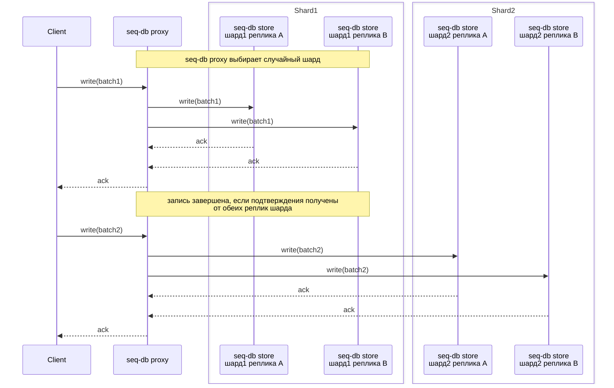
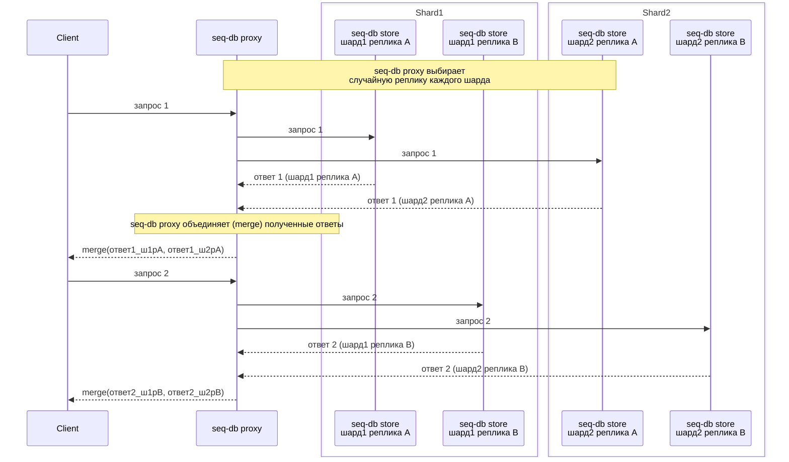

# Архитектура кластерного режима

## Обзор компонентов

В кластерном режиме seq-db состоит из двух основных компонентов:
- seq-db store (экземпляр seq-db, запущенный с флагом `--mode=store`)
- seq-db proxy (экземпляр seq-db, запущенный с флагом `--mode=proxy`).

### seq-db store
seq-db store — это stateful-компонент, который хранит все записанные документы и обрабатывает как чтение, так и запись.
Все данные, записанные в seq-db, в конечном итоге попадают в один или несколько store'ов.

#### Ключевые характеристики
- Развертывается как k8s `Statefulset`
- Архитектура без общего состояния (share-nothing): экземпляр seq-db store не знает о других store'ах.
- Поддерживает обратный индекс в памяти и на диске, что позволяет осуществлять поиск по индексированным полям.

#### Структура файлов
seq-db store хранит все данные документов в трех типах файлов:

| Тип файла | Назначение                                             |
|-----------|--------------------------------------------------------|
| `.docs`   | Хранит сжатые батчи сырых документов логов             |
| `.meta`   | Токенизированный поток метаданных (для восстановления) |
| `.index`  | Дисковый обратный индекс.                              |

Поскольку набор данных хранится в этих трех типах файлов, перемещение или восстановление шарда выполняется просто: достаточно скопировать (`cp` / `rsync`) директорию на целевой узел и запустить под.

Подробнее о типах файлов и их внутренней структуре читайте [здесь](internal/fractions.md).

#### Durability (обеспечение надежности)
Операция записи подтверждается только после того, как полезная нагрузка гарантированно сохранена:

```
write, fsync   # файл .meta
write, fsync   # файл .data
```
То есть, два системных вызова `write`, за которыми следуют два вызова `fsync` — это гарантирует, что данные переживут аварию узла или его перезапуск до того, как клиент получит ответ об успехе.
Индексация происходит асинхронно, поэтому обычно проходит менее 1 секунды, прежде чем вновь записанные документы становятся доступны для поисковых запросов.
Примечание: это значение может быть немного выше в периоды пиковой нагрузки.

### seq-db proxy
seq-db proxy — это stateless-координатор всего трафика чтения и записи.
Он поддерживает заданную пользователем топологию кластера и позволяет изменять распределение read-write трафика без изменений stateful-компонентов.

#### Ключевые характеристики
- Развертывается как k8s `Deployment`
- Выполняет логическую репликацию между store'ами
- Маршрутизирует трафик между уровнями хранения (hot/cold stores)

seq-db proxy токенизирует каждый входящий документ и сжимает батчи с помощью zstd / lz4 перед отправкой батчей в seq-db stores.

### Read-path & write-path (коэффициент репликации rf=2)
Давайте рассмотрим пример архитектуры с 4 шардами seq-db и коэффициентом репликации (replication-factor)=2 (каждый лог должен храниться в двух отдельных seq-db stores).
Обратите внимание, что реплики шарда могут располагаться в разных зонах доступности (availability zones).

### Write-path (путь записи)
Запись фиксируется (commit) только после того, как seq-db proxy получает подтверждение (ack) **от всех реплик целевого шарда**.



### Read-path (путь чтения)
В то время как записанный документ должен быть подтвержден всеми репликами шарда, чтение считается успешным, когда **хотя бы одна реплика каждого шарда** возвращает ответ.



## Примечания о репликации и согласованности (consistency)
seq-db не имеет каких-либо механизмов для поддержания согласованности реплик между собой.
То есть, если операция записи завершилась успешно на одной реплике шарда и завершилась ошибкой на другой, реплики окажутся 
в рассогласованном состоянии и не будут автоматически синхронизированы. Единственная предоставляемая гарантия 
заключается в том, что операция записи завершится успехом, только если как минимум RF реплик сохранили данные на диск.
Эта оптимизация позволяет seq-db иметь более высокую пропускную способность приема данных по сравнению с аналогами,
за очевидную цену — возможной несогласованности результатов запросов на получение гистограмм и агрегации.
seq-db был разработан как база данных для логов/трейсов с учетом этого компромисса.